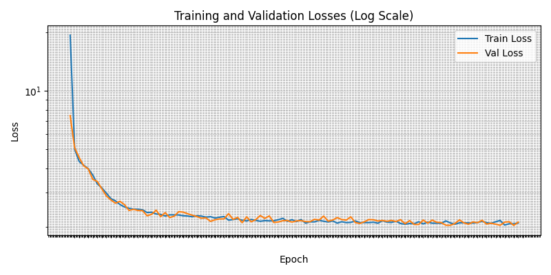
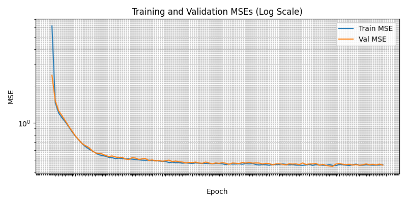
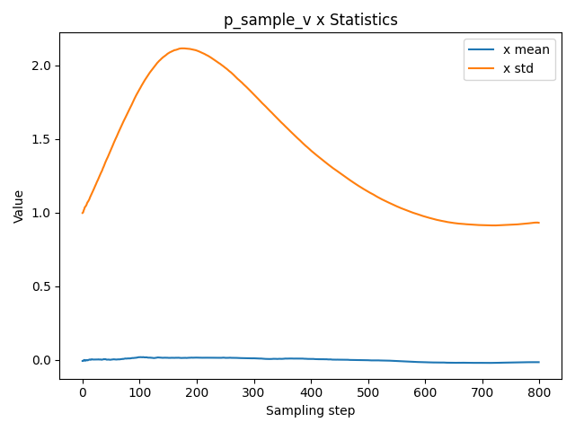

# SAMUeL-GEN: Efficient Vocal-Conditioned Music Generation via Soft Alignment Attention and Latent Diffusion

[](https://arxiv.org/abs/2507.19991)
[](https://opensource.org/licenses/MIT)
[](https://www.python.org/downloads/release/python-3110/)
[](https://pytorch.org/get-started/locally/)
This repository contains the official implementation of **SAMUeL-GEN**, a lightweight latent diffusion model for vocal-conditioned musical accompaniment generation. Our approach achieves **220× parameter reduction** and **52× faster inference** compared to state-of-the-art systems while maintaining competitive performance.

## Paper

**Efficient Vocal-Conditioned Music Generation via Soft Alignment Attention and Latent Diffusion**  
*Hei Shing Cheung, Boya Zhang*

[arXiv:2507.19991](https://arxiv.org/abs/2507.19991) [cs.SD]

## License

This project is licensed under the MIT License - see the [LICENSE](LICENSE) file for details.

## Key Features

- **Ultra-lightweight architecture**: Only 15M parameters vs. billions in existing models
- **Novel soft alignment attention**: Adaptively combines local and global temporal dependencies
- **V-parameterization**: More stable training compared to ε-prediction
- **Real-time capable**: Designed for consumer hardware deployment
- **Latent space operation**: Operates in compressed VAE latent space for efficiency

## Architecture Overview

Our model introduces several key innovations:

1. **Soft Alignment Attention Mechanism**: The core innovation is a soft alignment attention mechanism that dynamically balances local and global attention patterns through time-dependent weighting. This mechanism is based on the hierarchical diffusion process.

2. **Dual-mode Attention**:
    -  **Local attention** operates within sliding windows of size 16 to capture fine-grained temporal dependencies. The local attention for position *i* is computed as:
        $$
        \text{LocalAttn}(i) = \text{softmax}\left(\frac{Q_i K_{j \in W(i)}^T}{\sqrt{d}}\right)V
        $$
        where $W(i)$ is the local window around position $i$, and $Q, K, V$ are derived from convolutional projections.
    -  **Global attention** computes relationships across the entire sequence using rotary position embeddings (RoPE) for improved positional encoding. The global attention formula is:
        $$
        \text{GlobalAttn} = \text{softmax}\left(\frac{\text{ROPE}(Q)\text{ROPE}(K)^T}{\sqrt{d}}\right)V
        $$

3.  **FiLM Conditioning**: The architecture uses Feature-wise Linear Modulation (FiLM) layers to provide fine-grained temporal control and integrate timestep embeddings.

4.  **V-objective Training**: The model is trained to predict velocity, $v_t$, which is defined as:
    $$
    v_t = \alpha_t \epsilon - \sigma_t x_0
    $$

## Repository Structure

```
SAMUeL-GEN/
├── src/
│   ├── config.py          # Model configuration and hyperparameters
│   ├── model.py           # Main diffusion model with soft alignment attention
│   ├── diffusion.py       # Diffusion process implementation
│   ├── modules.py         # Building blocks (UNet, attention, etc.)
│   ├── train.py           # Training script
│   ├── inference.py       # Inference and sampling
│   ├── sample.py          # Sampling utilities
│   ├── data_utils.py      # Data preprocessing and loading
│   ├── utils.py           # General utilities
│   └── check_utils.py     # Validation and testing utilities
├── results/               # Training results and visualizations
│   ├── loss_curve.png
│   └── mse_curve.png
├── README.md
└── LICENSE
```

## Installation

### Prerequisites

- **Python**: 3.11
- **PyTorch**: 2.7
- **CUDA**: Optional, for GPU acceleration (recommended)

### Setup

1. Clone the repository:
```bash
git clone https://github.com/HaysonC/SAMUeL-GEN.git
cd SAMUeL-GEN
```

2. Install dependencies:
```bash
# Install from requirements file, or cd to source directory and run without src/ prefix
python -m venv venv
source venv/bin/activate  # On Windows use `venv\Scripts\activate`
pip install -r src/requirements.txt

# Or install core dependencies manually:
pip install torch>=2.0.0 torchvision>=0.15.0 torchaudio>=2.0.0
pip install numpy matplotlib tqdm scipy soundfile
```

3. Download the dataset:
The model expects encoded audio data. The default configuration uses the Kaggle dataset `boyazhangnb/encodedsongs`.

## Usage

### Quick Start

1. **Training**: Train the model from scratch
```bash
cd src
python train.py
```

2. **Inference**: Generate music with a trained model
```bash
cd src
python inference.py
```

3. **Sampling**: Run sampling utilities
```bash
cd src
python sample.py
```

### Training

To train the model from scratch:

```bash
cd src
python train.py
```

Key training parameters can be modified in `config.py`:
- `TRAINING_TIMESTEPS`: Number of diffusion steps (default: 800)
- `TRAINING_LR`: Learning rate (default: 3.5e-4)
- `TRAINING_EPOCHS`: Training epochs (default: 100)
- `MODEL_WINDOW_SIZE`: Local attention window size (default: 16)

### Inference

To generate music using a trained model:

```bash
cd src
python inference.py
```

The inference script will:
1. Load a trained model checkpoint
2. Allow you to specify conditioning input
3. Generate musical accompaniment using the diffusion sampling process
4. Save the output as audio files

### Configuration

Model architecture and training parameters are centralized in `config.py`:

```python
MODEL_UNET_SHAPES = [
    (64, 1024),   # Input: Feature=64, Temporal=1024
    (128, 512),   # Downsample
    (256, 256),   # Downsample  
    (512, 128),   # Bottleneck (with attention)
    (256, 256),   # Upsample
    (128, 512),   # Upsample
    (64, 1024),   # Output
]
```

## Performance

Our model achieves competitive results with significantly reduced computational requirements:

- **Parameters**: 15M (vs. ~3.3B in OpenAI Jukebox)
- **Inference Speed**: 52× faster than comparable models
- **Memory Efficiency**: 220× parameter reduction
- **Quality**: Competitive performance in production quality and content unity metrics

### Training Results

The model demonstrates stable training convergence and effective learning dynamics:


*Training loss progression showing stable convergence over epochs*


*Mean Squared Error curve demonstrating model learning efficiency*


*V-parameterization sampling statistics showing prediction quality*

### Key Metrics

- **Training Stability**: V-parameterization provides more stable training compared to ε-prediction
- **Convergence Speed**: Faster convergence due to soft alignment attention mechanism
- **Generation Quality**: Maintains high-quality outputs with significantly reduced parameters

## 🧪 Experimental Results

The model was evaluated on standard music generation benchmarks, demonstrating:
- Superior efficiency compared to autoregressive models
- Competitive musical coherence and quality
- Real-time generation capabilities on consumer hardware

Training curves and detailed results are available in the `results/` directory.

## 🔬 Technical Details

### Soft Alignment Attention

The core innovation is our adaptive attention mechanism that balances local and global context:

```python
# Timestep-dependent mixing
alpha_t = get_timestep_alpha(t)
context = alpha_t * context_local + (1 - alpha_t) * context_global
```

This allows the model to focus on fine-grained local patterns during early diffusion steps and global structure during later steps.

### V-Parameterization

Instead of predicting noise ε, our model predicts velocity v:
```
v_t = α_t * ε - σ_t * x_0
```

This parameterization provides more stable training dynamics and better convergence properties.

## Contributing

We welcome contributions to improve SAMUeL-GEN! Please feel free to:
- Report bugs and issues
- Suggest new features
- Submit pull requests
- Improve documentation

## Citation

If you use this code in your research, please cite our paper:

```bibtex
@article{cheung2025samuel,
  title={Efficient Vocal-Conditioned Music Generation via Soft Alignment Attention and Latent Diffusion},
  author={Cheung, Hei Shing and Zhang, Boya},
  journal={arXiv preprint arXiv:2507.19991},
  year={2025}
}
```

## Contact

For questions and collaborations:

- [Hei Shing Cheung](mailto:hayson.cheung@mail.utoronto.ca)
- [Boya Zhang](mailto:erhuboya.zhang@mail.utoronto.ca)

## Acknowledgments

We thank the research community for their foundational work in diffusion models and music generation. Special thanks to the creators of the datasets and tools that made this research possible.

---

**Note**: This is research code intended for academic and educational purposes. For production use, additional optimization and testing may be required.